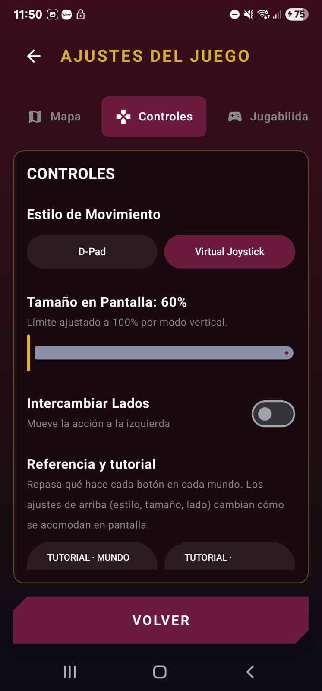
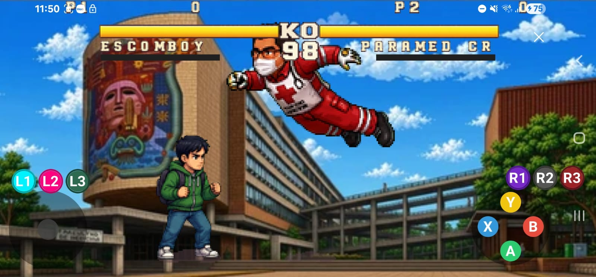
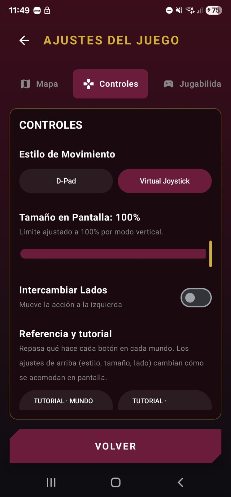
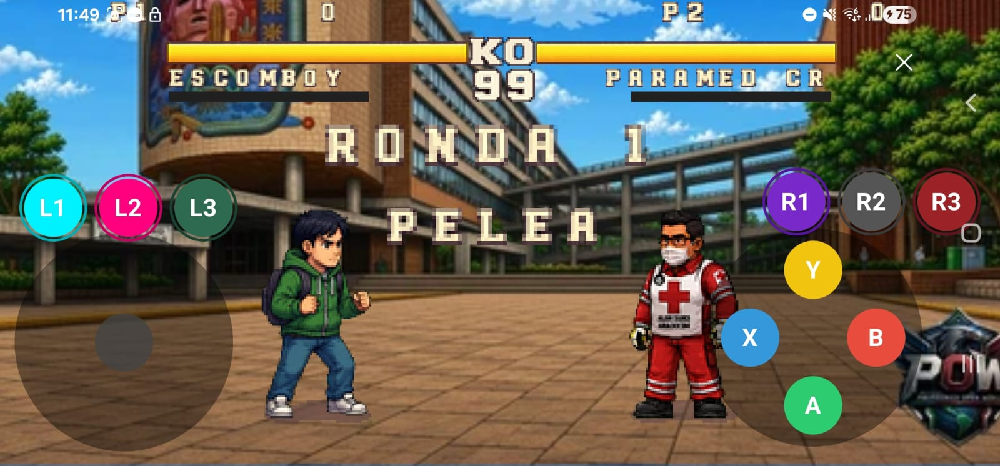
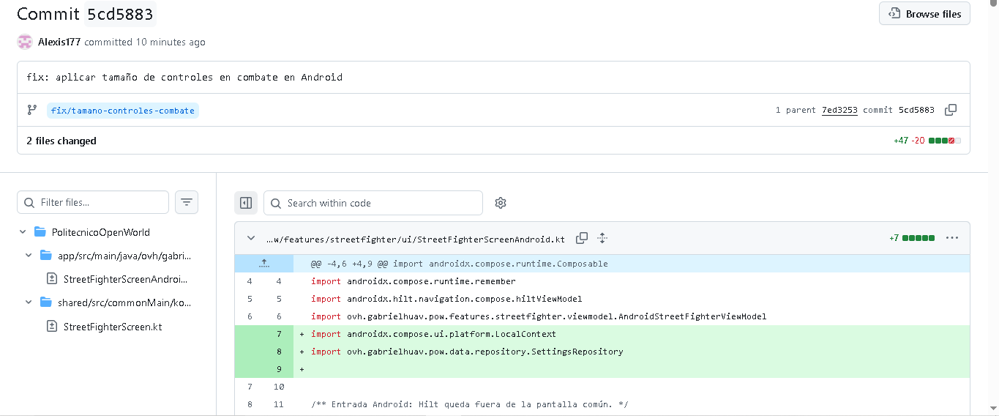

# Tamaño configurable de controles en Titulación por Combate

Contribución a **PolitecnicoOpenWorld** para que el modo Titulación por Combate en Android respete el tamaño de controles guardado en Ajustes.

## Datos de la contribución

| Dato | Valor |
| --- | --- |
| Autor de la contribución | Alexis177 |
| Proyecto original | [gabrielhuav/PolitecnicoOpenWorld](https://github.com/gabrielhuav/PolitecnicoOpenWorld) |
| Fork | [Alexis177/PolitecnicoOpenWorld](https://github.com/Alexis177/PolitecnicoOpenWorld) |
| Rama | `fix/tamano-controles-combate` |
| Commit de implementación | `5cd5883` |
| Mensaje del commit | `fix: aplicar tamaño de controles en combate en Android` |
| Dispositivo de prueba | Samsung Galaxy S22 Ultra |
| Versión de Android | No registrada |
| Pull request | Pendiente de crear durante la entrega del examen |

## Problema y objetivo

El mundo abierto utilizaba la preferencia de tamaño guardada en Ajustes. Sin embargo, la pantalla de Titulación por Combate no recibía esa preferencia: su joystick y sus botones conservaban dimensiones fijas.

El objetivo fue reutilizar el ajuste existente para que también modificara los controles de combate, sus separaciones y la posición de la indicación del joystick en el tutorial.

## Implementación

### Archivos modificados

Rutas relativas a la raíz del repositorio:

| Archivo | Cambio |
| --- | --- |
| `PolitecnicoOpenWorld/app/src/main/java/ovh/gabrielhuav/pow/features/streetfighter/ui/StreetFighterScreenAndroid.kt` | Leer el tamaño guardado mediante `SettingsRepository` y pasarlo a la pantalla común. |
| `PolitecnicoOpenWorld/shared/src/commonMain/kotlin/ovh/gabrielhuav/pow/features/streetfighter/ui/StreetFighterScreen.kt` | Aplicar el tamaño al joystick, botones principales, botones L/R, separaciones y posición de la indicación del tutorial. |

### Lectura de la configuración

En la entrada Android se obtiene el contexto y se lee la misma preferencia que ya utiliza el juego:

```kotlin
val context = LocalContext.current
val settings = remember(context) { SettingsRepository(context) }
val controlsScale = settings.getControlsScale()
```

El valor se pasa a `StreetFighterScreenCommon` mediante el parámetro `controlsScale: Float = 1f`. El valor predeterminado equivale al 100 %. No se añadió un sistema nuevo de almacenamiento.

### Cambio de dimensiones

Se usa el parámetro `tamano` de los componentes existentes para modificar sus dimensiones reales de diseño, incluyendo su zona de interacción, en lugar de aplicar únicamente una transformación visual.

Ejemplo del joystick:

```kotlin
tamano = 180.dp * controlsScale.coerceIn(0.6f, 1.4f)
```

Para los botones se utiliza una base de `48.dp` multiplicada por la escala. El factor se limita al rango de 0.6 a 1.4 en los grupos de controles. `dp` es una unidad independiente de la densidad de la pantalla.

| Dimensión base | Al 60 % | Al 100 % |
| --- | --- | --- |
| Diámetro del joystick | 108 dp | 180 dp |
| Diámetro de cada botón | 28.8 dp | 48 dp |
| Diámetro del contenedor de botones principales | 108 dp | 180 dp |

El espacio total ocupado por cada botón también incluye su padding. Las letras de los botones conservan su tamaño de fuente existente.

El cambio contempla los botones Y, X, B, A y P, así como L1, L2, L3, R1, R2 y R3 cuando el personaje dispone de ellos. También ajusta los espacios y la posición vertical de las filas superiores, conservando sus posiciones anteriores al 100 %.

## Pruebas y resultados

Las pruebas manuales se realizaron en un **Samsung Galaxy S22 Ultra**. Los resultados de interacción y persistencia fueron confirmados por el autor de la contribución; las capturas documentan el aspecto visual.

| Prueba | Resultado |
| --- | --- |
| Ejecutar la versión modificada en el celular | Confirmado por el autor. |
| Guardar 60 % y entrar a combate | Joystick y botones reducidos; documentado en capturas. |
| Guardar 100 % y entrar a combate | Joystick y botones de mayor tamaño; documentado en capturas. |
| Respuesta de los controles en ambos tamaños | El autor confirmó que responden correctamente. |
| Cerrar y volver a abrir la aplicación | El autor confirmó que conserva el tamaño guardado. |
| Revisar superposiciones y recortes | El autor no observó botones encimados ni recortados en las pruebas realizadas. |
| Revisión de espacios mediante `git diff --check` antes del commit | Sin problemas reportados. |

No se añadieron pruebas automatizadas para este cambio visual. No se documentó una prueba al 140 %, del botón P, de la indicación del tutorial ni de regresión en mundo abierto. Los resultados anteriores corresponden al dispositivo y a los escenarios probados; una captura estática no demuestra por sí sola la respuesta táctil.

## Evidencia visual

Las imágenes de combate utilizan el mismo personaje, rival y orientación horizontal. Ambas muestran la versión modificada con diferentes ajustes; no son una comparación entre la versión original y la corregida.

### Ajustes al 60 %

La pantalla muestra el valor de tamaño seleccionado para la prueba reducida.



### Combate al 60 %

El joystick, los botones principales y las filas L/R se muestran con dimensiones reducidas.



### Ajustes al 100 %

La pantalla muestra el valor de tamaño seleccionado para la segunda prueba.



### Combate al 100 %

Los controles ocupan más espacio que al 60 %. Se aprecia el cambio tanto en el joystick como en los botones principales y superiores.



### Commit publicado en GitHub

La captura muestra el commit `5cd5883`, la rama de trabajo y los dos archivos de código modificados: 47 líneas añadidas y 20 eliminadas. Estos datos corresponden al commit de implementación, antes de agregar esta documentación.



## Alcance de la contribución

- Se conecta la preferencia desde la entrada Android. Las llamadas de otras plataformas que no proporcionan el parámetro mantienen el 100 %.
- Se modifica el tamaño de los controles; no se incorpora intercambio de lados ni selección de D-Pad en combate.
- No se modifican las acciones de ataque, las reglas de combate ni el sistema de guardado de preferencias.
- La versión de Android no se registró y no se deduce del modelo del dispositivo.

## Flujo de trabajo con Git

1. Crear un fork del repositorio original en la cuenta Alexis177.
2. Clonar el fork y abrir el proyecto Android en Android Studio.
3. Ejecutar la aplicación original en el celular.
4. Crear la rama `fix/tamano-controles-combate`.
5. Implementar el cambio y realizar las pruebas manuales.
6. Guardar el cambio con commit y subir la rama al fork mediante push.
7. Agregar esta documentación y sus capturas en un commit adicional de la misma rama.
8. Durante el examen, crear el pull request hacia `gabrielhuav/PolitecnicoOpenWorld`, rama `main`.

El commit y el push de la implementación ya se realizaron. La incorporación de esta documentación y la creación del pull request son pasos posteriores. Un push actualiza la rama del fork; integrar el cambio al repositorio original requiere que el mantenedor acepte el pull request.

## Entrega del pull request

El PR se creará durante el examen. Después de publicarlo, registrar aquí su enlace y, si se solicita, una captura donde se vean el título, número y repositorio de destino.

Título propuesto: **fix: apply control size settings to combat mode on Android**.

## Explicación breve para el examen

> Detecté que el modo de combate no utilizaba la preferencia de tamaño de controles. Reutilicé SettingsRepository para leer el valor guardado y lo pasé a la pantalla de combate. Apliqué ese factor a las dimensiones del joystick, los botones y sus separaciones, conservando el tamaño original al 100 %. Lo probé al 60 % y al 100 % en un Samsung Galaxy S22 Ultra: los controles respondieron y el ajuste se conservó al volver a abrir la aplicación. El cambio se guardó en una rama de mi fork para proponerlo mediante un pull request.

## Documentos de entrega

- [Bitácora en español](BITACORA.md).
- [Descripción del PR en inglés](PR_DESCRIPTION.md).
- El título del PR se encuentra en PR_TITLE.txt.

